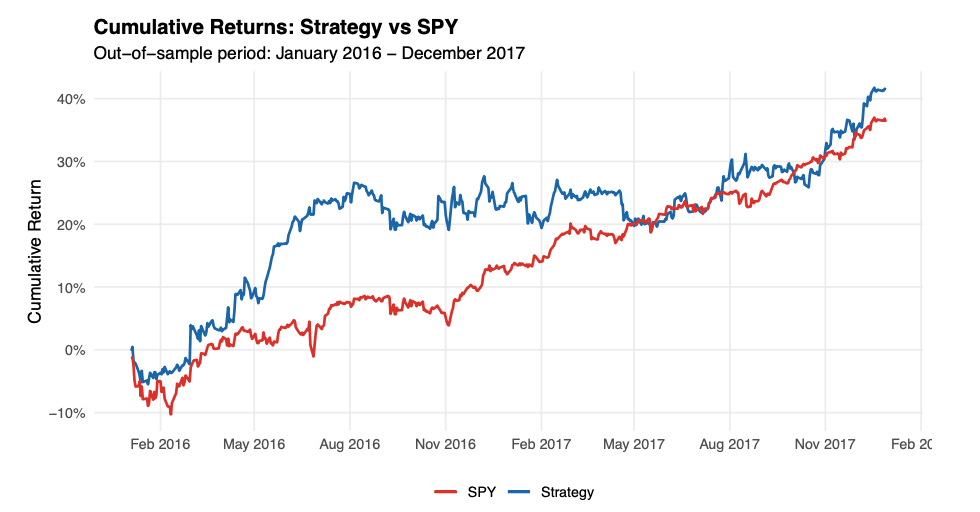
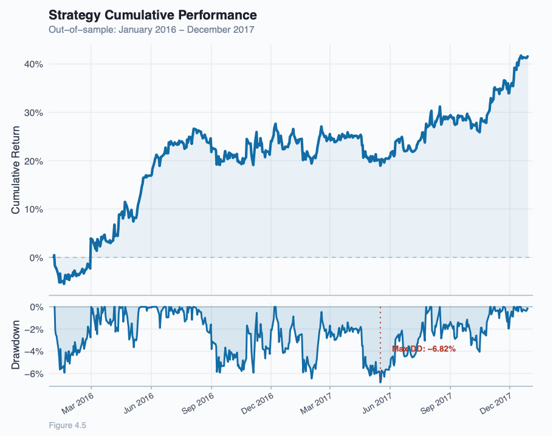

# Black-Litterman Portfolio Allocation with Cointegration-Based Pair Trading Signals

Master Thesis Project – Quantitative Finance

Author: Tommaso Tauro

## Overview

This project develops a quantitative portfolio allocation framework that integrates cointegration-based pair trading signals into the Black-Litterman model.

The objective is to transform statistical arbitrage opportunities into systematic Bayesian views that can be incorporated into a portfolio optimization process.

The framework combines:

- Engle-Granger cointegration testing
- Augmented Dickey-Fuller stationarity testing
- Ornstein-Uhlenbeck spread modelling
- S-score signal generation
- Black-Litterman Bayesian updating
- Mean-Variance Optimization
- Rolling-window backtesting

## Dataset

- 45 US equities
- 9 GICS sectors
- Yahoo Finance data
- Sample period: 2004–2018
- Training period: 2006–2015
- Out-of-sample period: 2016–2017

## Methodology

1. Construction of a universe of 45 stocks grouped into 9 sectors.

2. Generation of 90 intra-sector candidate pairs.

3. Cointegration testing using the Engle-Granger procedure.

4. Estimation of Ornstein-Uhlenbeck mean-reverting spread dynamics.

5. Generation of trading signals through s-scores.

6. Transformation of pair trading signals into Black-Litterman views.

7. Computation of posterior expected returns.

8. Mean-variance portfolio optimization.

9. Out-of-sample backtesting.

## Results

### Out-of-Sample Performance (2016–2017)

| Metric | Strategy | SPY |
|----------|----------|----------|
| Total Return | 41.44% | 36.31% |
| Annualized Return | 18.27% | 16.06% |
| Volatility | 13.42% | 10.39% |
| Sharpe Ratio | 1.361 | 1.546 |
| Max Drawdown | -6.82% | -9.19% |
| Calmar Ratio | 2.678 | 1.748 |
## Visual Results

### Strategy vs Benchmark

### Performance and Drawdown

## Technologies

- R
- quantmod
- tseries
- xts
- zoo
- PerformanceAnalytics
